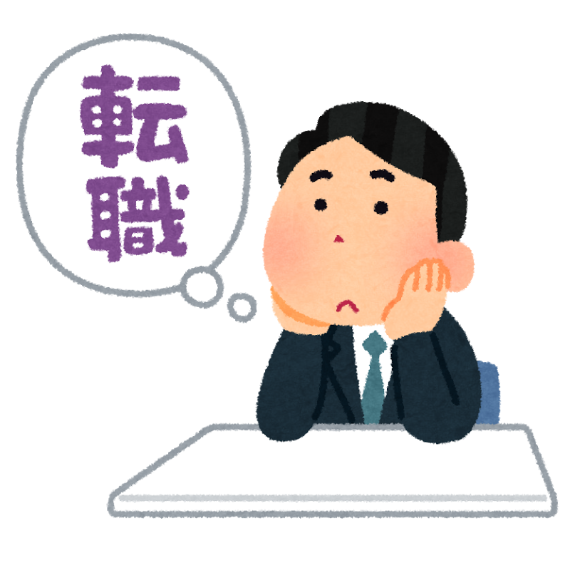
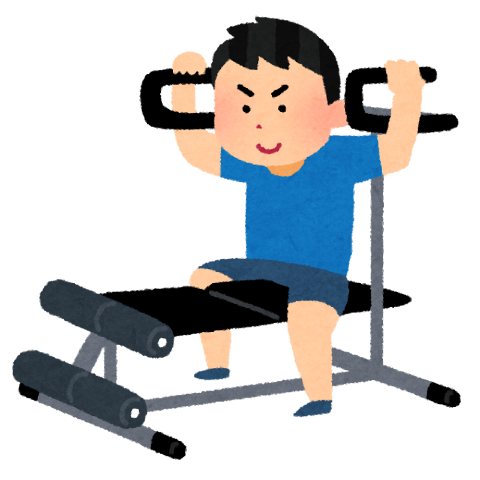

2月の中旬から始めた無職生活ですが、GW明けから働き始めることになったため、そろそろ終わりを迎えようとしています。  
無職の間に何をして、何を考えていたかを「無職活動報告」としてここに書き残そうと思います。

## 転職活動

新卒の就活で苦労した方だったので、「転職活動やりたくないなー」という気持ちが強かったんだけど、やってみたらこれが意外と楽しかった。そう感じた大きな要因としては、

* 自信を持って話せる経験がある
* 学生時代なら相手してもらえなかった会社の人に会える
* 因果関係がちゃんとわかる

というところが大きかったように思う。

### 自信を持って話せる経験がある
学生の頃は、学生時代に打ち込んだと言い切れるほどの経験が正直なくて、  
「この話したら響くかな？」  
みたいなエピソードを自分の経験から必死で探して、ひねり出して、それっぽく話すしかなかった。結局、フルタイムで働いた経験は学生にはないので、想像でやっていくしかなく、それは周りの学生も同じのようで、巷にはいわゆる「納豆人間」((「私は納豆のように粘り強い人間です！」という自己PR。亜種として、「人間関係を円滑にする」潤滑油人間、「スポンジのようになんでも吸収する」スポンジ人間などがいたと思う。皆さんは何人間でしたか？))が溢れていた。

転職活動では、この点が大幅に改善された。  
実務で実際に経験してきたことを話せるので、ものすごくやりやすいのだ。

* これまでで一番やりがいを感じた瞬間は？
* これまでに一番苦労したことは？
* その経験から学んだことは？

こういったお決まりの質問が、これまでの実務経験から、具体的なエピソードを踏まえて、間にちょっと冗談を交えたりしながら話せる。話せることが無限にある、というのは新卒就活で苦労した人間からすると革命的で、「強くてニューゲーム」してるような気持ちになれた。

### 学生時代なら相手してもらえなかった会社の人に会える
自分は文系大学の出身だったので、技術系の仕事に就きたい、と思って履歴書を送っても結構な確率でお祈りされてしまうことが多かった(とはいえ、趣味プロダクトとかちゃんとやってる人であれば、その限りではないと思います)。

ただ、転職活動だと、大学での専攻よりも前職でのキャリアに目が向く。  
職務経歴書をかなり気張って書いておくと、学生時代に書類段階でスルーされていた、憧れのイケイケな会社の会議室に通されたりするので、未来が開ける気持ちになると思う。

### 因果関係がちゃんとわかる
楽しい気持ちで活動できた一番の要因は多分これ。

転職活動では、基本的にみんなエージェントをつけて活動をすると思うんだけど、このエージェント氏がめちゃくちゃ優秀で、

* 履歴書、職務経歴書の添削をしてもらえる
* 書類審査で落ちた理由をフィードバックしてもらえる
    * メインで使ってる言語の経験が浅い、とか
    * 目的としてる人材を採用できたので募集自体を打ち切った、とか
* (本人が希望すれば)面接対策をかなり丁寧にやってくれる
* 面接で落ちた理由のフィードバックをもらえる
    * 人柄はいいんだけど筆記課題の点数がだめ、とか
    * 経験とかに問題はないんだけど、社内でポジションを用意できなかった、とか

この人がいてくれるだけで、ざっと、これだけのメリットがある。  
就活自殺の背景には「落とされた理由がよく分からない」「自分のこれまでの人生を全否定されたような気持ちになる」ということがあったと記憶しているんだけど、エージェント氏がいれば、そういった不安とは概ね無縁でいられると思う。

あと、面接が通過した場合にも「どういう点が評価されたか」のフィードバックがもらえるし、企業の人材募集の背景なんかも教えてもらえるので、「自分をどう見せるか」みたいな作戦もめちゃくちゃ立てやすい。

で、上記のようなストレスフリーな環境で活動できるおかげで、自己分析にちゃんと時間をかけられるようになる。例えば、

* 何をやってる時に喜びを感じるのか
* 今後、どういうキャリアパスを歩みたいのか
* 3年後、5年後どうなりたいのか

みたいなことって本来はめちゃめちゃ大事だったはずなんだけど、大人になると、目の前の仕事をこなすのに忙しくなって、だんだんと忘れていってしまう。さりとて、学生時代には「そんなん言われてもわかんねーよ」って感じだと思う(そうじゃない人はすみません)。

忘れてしまった「本当はこうありたかったはずだよな」という気持ちを思い出せただけでも、無職期間と、そこからの転職活動には意義があったと思う。

## 筋トレ

ガリガリな体に対するコンプレックスを解消したかったので、ジムに通い始めた。  
筋トレの良いところとしては、代謝がよくなって痩せる、単純にかっこいい体になれる、というのももちろんあるんだけど、副次的な効果として、

* 自分の体調の良し悪しが分かるようになる
* 胸を張って生活できるようになる

みたいなところもあると思う。

### 自分の体調の良し悪しが分かるようになる
これまでは、なんとなく体調の悪いような日があっても  
「まあ気のせいだろ」  
と思って無理をしてしまうことが多かったんだけど、筋トレをするようになると、今日は体調が悪いから休もう、という判断がちゃんと下せるようになる。

判断基準は明確で、普段こなせる運動がいつも通りにできるかどうか。  
睡眠不足だったり、食事量が少なかったりすると、いつもなら上げられる重量が上がらなかったり、量をこなせなかったり、反応が分かりやすい形で現れてくる。  
ちゃんと負荷がかけられないと、筋肉が育たなくて、フラストレーションが溜まるので、自然と規則正しい生活と十分な食事を意識するようになる、という訳である。筋トレすごい。実によくできてる。

### 胸を張って生活できるようになる
エンジニアがやっていく気持ちを作るために必要なのは、  
「やったことないけどまあ勉強すればできるやろ」  
という自己肯定感だよな、と常々思っていて、自己肯定感を健全に醸成するためには、目標の策定と達成の繰り返しが必要だと思うんだけど、そのサイクルをうまく回す仕組みとして、筋トレはものすごく分かりやすい。

目標を数値化しやすいし、できたか/できないかで毎日の効果測定もしやすい。  
何より、成果が外見に分かりやすく現れてくるのが抜群に良い。

あと、マシントレーニングをするときの正しい姿勢は「胸を張ること」であることが多くて、「胸を張って生きろ」みたいな言説に「うるせえ」って反発しがちな人も、正しいフォームを学習する過程でちゃんと胸を張るようになる。  
色々あって気持ちが落ち込んでいる人は、とりあえず筋トレを始めてみると、根拠は一旦置いといて、胸を張って、前を見て歩けるようになるので良いんじゃないでしょうか。

## 今後どうするか
面接で、  
「自分のなるべき姿になるために何が足りないと思う？」  
みたいな質問をされて、色々と思うところがあったので、今後はインプットとアウトプットを頑張ろうと思います。具体的にはこんな感じ。

* インプット
    * 勉強会ちゃんと行ったりとか
    * 雑誌読んで最新動向ちゃんと追いかけたりとか
* アウトプット
    * やったことちゃんとブログに残したりとか
    * GitHubにもリポジトリ立てて上げたりとか

現場からは以上です。