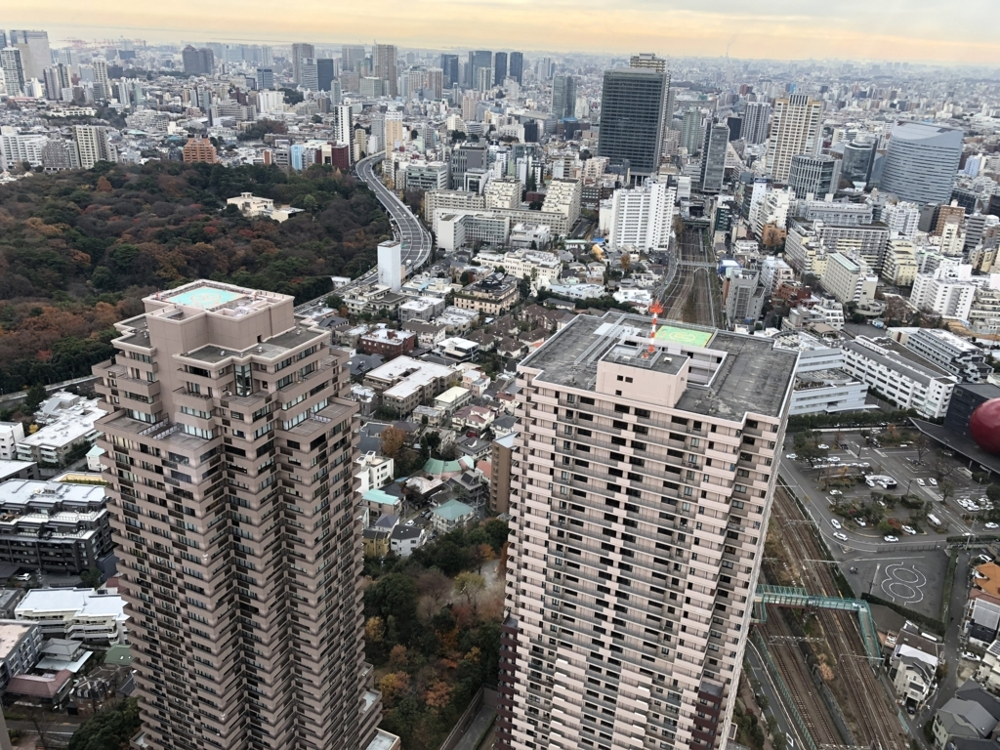

年末の 1on1 でなんだかうまく喋れなかったので、去年の振り返りを書いてみる。ガーデンプレイスの39階で「恵比寿はワシのもんや！」と言いながら撮った写真とともにお楽しみください。

## 良い習慣を持てるようになった
2017年5月、人生で初の転職を経験した。

転職して良かったこととしては、年収が上がった、新しい技術に触れられるようになった、など色々あるけれど、一番大きいのは時間の余裕ができたことだと思う。土日と祝日に憂いなく休める環境のおかげで、習慣的に物事に取り組めるようになった。

習慣化できたこととしては３つあって、そのうちの１つは読書。技術書とかクレカに関する本を毎週末読むようになって、今年だけで 15 冊読めた。また、今年からは本の内容を MarkDown で要約して gist にアップし、ブログにリンクを貼り付ける、ということを試験的にやってみている。前職で「お前は知識はあるけど知恵がないな」とか言われたのを僕はいまだに根に持っていて、読んだ本の内容をちゃんと自分に根付かせる方法をずっと模索していたのだけど、ようやくしっくりくるやり方が見つかった気がする。

２つ目はエンジニア勉強会の定期参加。JJUG、渋谷Java、API STUDY、Security-JAWS、Fin-JAWS、Tech Beer Bash、SRE Meetup Tokyo、PPUG など色々な勉強会に顔を出した。社外の勉強会というものに対してずっと憧れを抱いていたため、その反動でちょっと出歩き過ぎたかな、というきらいはあるけれど、会を通じて多くのエンジニアと知り合いになれて「俺ももっと頑張らなきゃなー」という気持ちを強くすることができた。勉強会で拾ってきた情報を持ち帰って社内に共有しまくってたら割と喜ばれたので、こちらの活動も引き続きやっていけるといいな、と思っている。

３つ目は運動。 [ここ](/1493856000) で書いた筋トレが意外にもまだ継続できていて、2017年12月末の時点でも、毎週一回ペースを継続できている。「体育会系マインド身に付けるのとか無理だし目標管理とか絶対にできる気がしないので、パーソナルトレーナーに金払ってアウトソースしたろ」と割り切ったスタンスで臨んだのが良かったんだと思う。社の人の影響で、今ではランニングも習慣的にやるようになっていて、毎週５kmくらいは走るようになった。

習慣化の力ってすごくて、「毎週決まった時間にこれをやるぞ」と決めていると、いつもの行動を取っていないだけでなんだかムズムズしてくるようになる。前職での気に入らなかったことに「お前みたいな馬鹿が俺以外の下で働けると思うなよ」という発言があり、いまだに根に持っているんだけど（二回目）、頭が悪かろうと、物覚えが悪かろうと、コツコツ積み上げた知識と経験があればそれなりに戦えるはずだと思っていて、今年は多少なりそれを証明できたので良かったと思う。引き続き良い習慣をやっていきましょう。

## 得意分野を活かして働けるようになった
前職では、フロントエンドとバックエンドを全てできるようにする必要があり（というよりフロントとバックエンドを分けるという発想がそもそもなかった）、苦手な UI 周りの作業でドチャクソ怒られて意気消沈することが多かった。「苦手なことを克服しなければお前に生きる道はない」とひたすら脅され続けて育ったんですけど、なんか、世の中そういう訳じゃないみたいですね。

今の職場では（比較的）得意な方の技術スタックであるバックエンドの仕事を主にさせてもらっている。好きこそものの上手なれ、じゃないけれど、得意なことをやってると楽しく働けて、楽しいと学習意欲が湧くので自然に勉強するようになって、できることが色々増えていく。

前向きな気持ちで働いていると得意ジャンルも増えるのか、最近では資料作成のタスクもうまくやれるようになってきた。多分、知識を十分に噛み砕いてから作業を始めるのがコツなんだと思う。前職では何か資料を作るたびにドチャクソ怒られてて、ずっと資料作成に対して苦手意識があったんだけど、これまでの苦労は一体なんだったんだと遠い気持ちになる。

あとは、JAWS 系のイベントに参加しまくったおかげか、インフラ系、セキュリティ系の仕事についてもちょっとずつできることが増えてきた。Security by Design の観点から、どうすればより良い構成にできるかを考えるのはとても楽しい。人に何かを説明するような機会も（事前に資料とか図とかを起こして整理した上であれば）うまくやれる自信がついてきたので、引き続きできることを増やしていきたい。

## もっと色んなものを早く作れたはず
ここからは反省パート。

ある程度は覚悟していたことだったけれど、とにかく自分の知識不足がやばく、調べ物や、指摘修正に多くの時間がかかってしまい、全体的にゆっくりとした進行になってしまった。

例えば、API 設計の基礎知識が足りていないために、レビューで根幹を揺るがす指摘をもらってしまい中々リリースできない状況になったりとか。AWS のインフラ知識が足りていないために中々手順を整理できず、リリース日が遅くなったりとか。前者は『Web API: The Good Parts』、後者は『Amazon Web Services実践入門』あたりを読んで勉強する必要があるなあ、と思っている。

- [Web API: The Good Parts | 水野 貴明 |本 | 通販 | Amazon](https://www.amazon.co.jp/dp/4873116864/)
- [Amazon Web Services実践入門 (WEB+DB PRESS plus) | 舘岡 守, 今井 智明, 永淵 恭子, 間瀬 哲也, 三浦 悟, 柳瀬 任章 |本 | 通販 | Amazon](https://www.amazon.co.jp/dp/4774176737/)

あとは、教養として『安全なWebアプリケーションの作り方』『マイクロサービスアーキテクチャ』あたりも抑えておきたい。特に一冊目は事前に読んでおけばもっと色んな説明がスムーズにできたと思うので……。

- [体系的に学ぶ 安全なWebアプリケーションの作り方 脆弱性が生まれる原理と対策の実践 | 徳丸 浩 |本 | 通販 | Amazon](https://www.amazon.co.jp/dp/4797361190/)
- [マイクロサービスアーキテクチャ | Sam Newman, 佐藤 直生, 木下 哲也 |本 | 通販 | Amazon](https://www.amazon.co.jp/dp/4873117607/)

## 2018年やりたいこと
- 技術書展に出店する
- 何かしらの勉強会で発表できるようになる
- AWS ソリューションアーキテクトアソシエイトを受ける
- 上に挙げた本を読む
- もっとコードを書く
- テストをもっとよくする
- 監査をもっと楽にする
- ベンチプレス 50kg 上げられるようになる
- ハーフマラソンを完走する

という感じで頑張ります。

直近としては、バックエンドの設計・開発力と AWS 力にステ振りして、もっと色んなものを早く作れるようになりたい。あと、根に持つのをやめる。