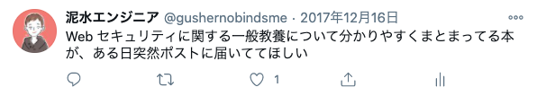

とか言ってたら、社長に『安全なWebアプリケーションの作り方』を買ってもらえました。感謝。

さて、『安全なWebアプリケーションの作り方』についてですが、こちらも今更僕が何かを語るまでもないソフトウェア開発の名著です。Web セキュリティの第一人者、徳丸先生の書いたセキュリティ本。

セキュリティ監査の対応とかやってた割に、この辺の知識を体系的に説明できないのがコンプレックスで、来年の監査が始まる前に読んでおこうと思ったのがきっかけです。

- [体系的に学ぶ 安全なWebアプリケーションの作り方 脆弱性が生まれる原理と対策の実践 | 徳丸 浩 |本 | 通販 | Amazon](https://www.amazon.co.jp/dp/4797361190/)

この本の良いところはとにかく徹底して「体系的」なこと。

クロスサイトスクリプティング、SQL インジェクションなどの代表的なセキュリティ上のバグを取り上げ、それらについて、

- どんな箇所で起きるか
- どんな影響があるか
- 利用者の関与が必要か
- 脆弱性が生まれる原因
- 対策方法

が漏れなく説明されており、セキュリティ対策として「どういう理由で何をすればいいのか」が一目でわかる。常に手元に置いておきたい一冊です。

本の構成についても、そもそも Web 脆弱性とは何か、から始まり、HTTP やセッション管理など、Web の仕組みのおさらいをした上で、Web アプリケーションの機能別にみるセキュリティバグ（SQLインジェクションとか）、セキュリティ機能（認証・認可とか）の話に移る、という構成で、迷子にならずにスイスイ読めます。

今年の６月に改訂版が出版される、という話も出ていて、 Web API、JavaScript のセキュリティについてや、安全でないデシリアライゼーション、XXE に関する解説が追加されるそうです。未読の人は、ちょうどいいタイミングなので読んでみるといいんじゃないでしょうか。

以下、いつのも読書メモです。

- [安全なWebアプリケーションの作り方_読書メモ](https://gist.github.com/gushernobindsme/17374408fa2ac28409e441b8acefbf23)