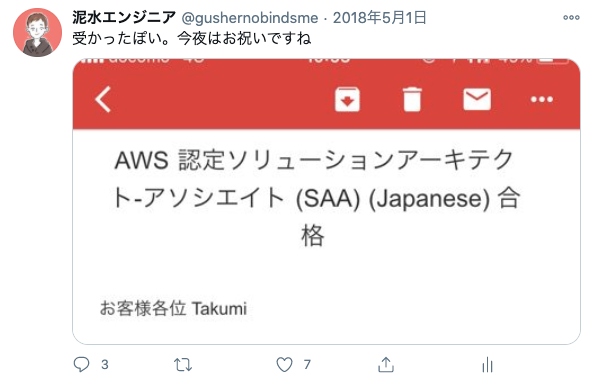

## 経緯
AWS は実務で触っていて、なんとなく使えてはいるんだけど、

- 「なんとなく使える」の域から脱したい
- AWS についての体系的な知識を獲得したい

ということで AWS SAA（ソリューションアーキテクトアソシエイト）試験を受けてみました。

試験受けるなら対策本買わなきゃね、ってことで手に取ったのがリックテレコムの『合格対策 AWS 認定ソリューションアーキテクト・アソシエイト』。おそらく、現時点で唯一の AWS 試験対策本です。この本なしでは合格できなかった……出版してくれてありがとう……。

- [合格対策 AWS認定ソリューションアーキテクト - アソシエイト | 大塚康徳(日立インフォメーションアカデミー) |本 | 通販 | Amazon](https://www.amazon.co.jp/dp/486594043X)

## やったこと
受験するにあたって、まずは『合格対策 AWS 認定ソリューションアーキテクト・アソシエイト』を読了。AWS の用語の説明だけに終始せず、クラウドでシステムを構築する上で重要な考え方についてもしっかり書かれているため、すんなり読めた印象。最新のサービスについては言及されていないものの、基礎を身につけるにはとても良い本でした。

いつもの読書メモを置いておきます。

- [合格対策 AWS 認定ソリューションアーキテクトアソシエイト_読書メモ](https://gist.github.com/gushernobindsme/f9694f55c892ee3f1ae7b83c187a488b)

で、早速 AWS のサイトから模擬試験を受験してみたんだけれど、これが全然答えられない。全然わからない、ってほど致命的ではないんだけど、自信を持って答えを選べない感じ。で、試験対策の定石通り問題演習やんなきゃだめかなあ、と思っていたところいいサイトが見つかったので、ひたすらここで問題を解いておりました。

- [AWS WEB問題集で学習しよう](https://aws.koiwaclub.com/)

ある程度「量」を解いておきたかったので、上記のサイトのシルバープランに加入。1,580 円を Stripe 経由で支払うと、サイト運営者が作成した 120 題のオリジナル問題が解けるようになります。やってみたらまあ、結構解けなかったので、不正解だった問題の解説文をまとめて、こちらも markdown を gist にあげて眺めることにしました。

- [AWS Solution Architect Assosiate 苦手分野メモ](https://gist.github.com/gushernobindsme/0e0f3a6471336be022c3c8deb4942e70)

で、いけそうかな？という自信がついてきたので秋葉原の試験会場を予約して受験。5/1 に無事合格判定をもらえました。すごいあっさりしたメールで通知が来るのでちょっと不安になる。

## 反省点とか
- 合格こそしたからいいものの、正答率があんましよくない（65%）
- とはいえ、 gist になんでも残す作戦は試験対策でも有効っぽい
- 模擬試験に 2,160 円、WEB 試験の有料会員登録に 1,580 円かかるが、とにかく金をケチらないことが合格の秘訣
- 『AWS 認定ソリューションアーキテクト – アソシエイト (新版)』というのが 2018 年 4 月付でリリースされてるんだけど、チキって古い方を受けてしまった
- 老害になりたくない人は新しい方を受けましょう

お仕事に活かせるといいですね。おわり。