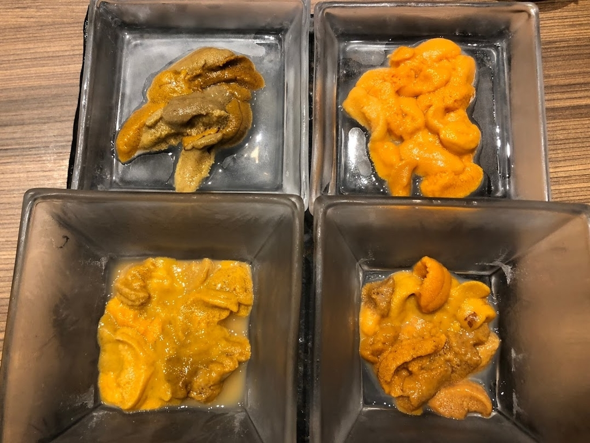
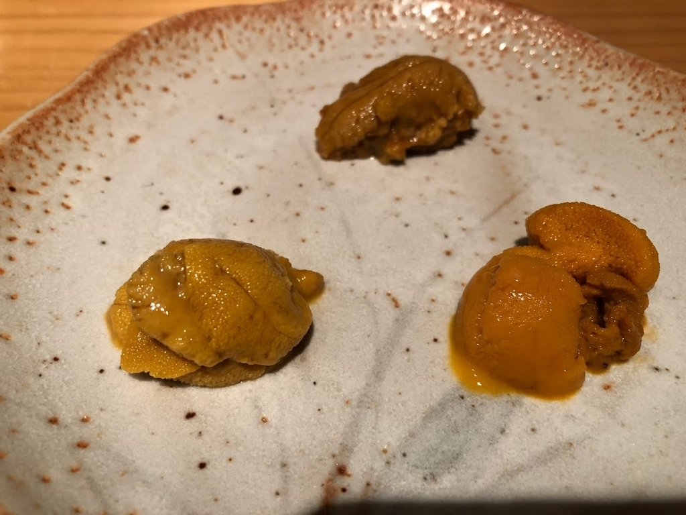
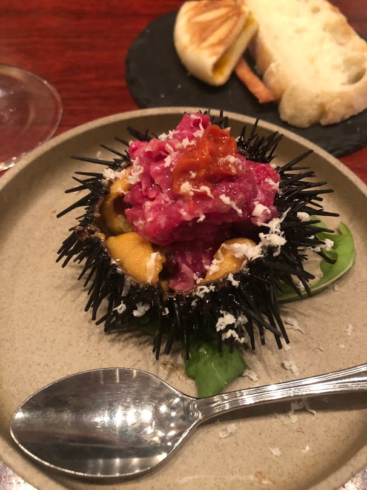
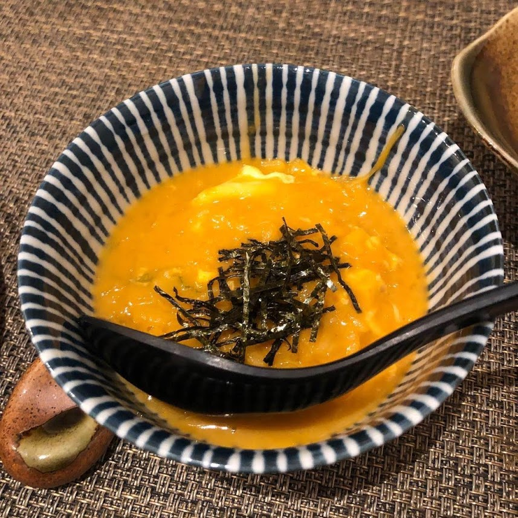

去年やってみたら意外とよかったので今年も振り返りを書いてみる。日々撮り貯めていたウニの写真と共にお楽しみください。

# インフラ面でできることが増えた

今年はちょうど、小規模な Web アプリケーションのインフラをイチから自分で設計・構築してみる、という機会に恵まれて、これのお陰で AWS インフラの理解が進んだ。VPC 切って、サブネット切って、NAT ゲートウェイとインターネットゲートウェイをアタッチして、ルートテーブル設定して……みたいなところって、実際に自分でやってみないとなかなか理解できないところだと思うんだけど、実業務でそれを経験できたのは非常にラッキーだった。ネットワークを基礎から学び直す時間が作れたのもよかったです。

- [『この一冊で全部わかるネットワークの基本』を読んだ](/1518822000)

あとは、AWS ソリューションアーキテクト・アソシエイトを受けてみたりもした。試験対策はある程度必要になるけれど、AWS のインフラ知識を体系的に身につけられる良い試験でした。

- [『合格対策 AWS 認定ソリューションアーキテクト・アソシエイト』を読んで AWS SAA に合格した](/1525305600)

上期できちんと基礎を身につけられたお陰で下期からはインフラの改善業にもきちんと参加できるようになって、既存のサーバのSSL 証明書を Certificate Manager に総入れ替えしたり、一部のサーバを ECS に移行したりしてました。特に ECS は、実際に手を動かしてみることでクラスタ・タスク・サービスの関係性がちゃんと理解できて、とても勉強になりました。老害にならないで済みそうでよかった。

写真は『うに小屋』渋谷店のウニ４種盛りです。

# アプリケーション面でできることが増えた

REST API の勉強をやり直したり、モバイルアプリ向けのエンドポイント群を一揃い設計する仕事を取りに行ったりしたお陰で、去年よりは API 設計をちゃんとできるようになった。特に『Web API: The Good Parts』をきちんと読み直したのが奏功したかなあと思っていて、仕様の妥当性を第三者にきちんと説明しきれるエンドポイントが作れたと思う。

- [『Web API The Good Parts』を読んだ](/1526169600)

去年はハチャメチャなエンドポイントを実装してはハチャメチャに直される、みたいな状況を繰り返していたので、今年はそれが改善できてよかったかな。

写真は中目黒のお寿司屋さん『鮨 尚充』のウニ三種盛りです。

# 外部の勉強会で登壇できた

今年は [FinTech Engineers Drink Up](https://fintech-engineers-drink-up.connpass.com/event/95366/) というイベントにお誘いいただいて、人生初の登壇を経験することができた。「30 歳になる前に勉強会の登壇ができるエンジニアになる」という夢が叶ったのがエポックで大変よかったです。「また一緒に何かやりましょう！」と言ってもらえたのもすごく嬉しかった……引き続き頑張ります。

- [FinTech Engineers Drink Up #2 - connpass](https://fintech-engineers-drink-up.connpass.com/event/95366/)

写真は恵比寿に店を構える『ALMA』にて期間限定で開催されたウニ祭りの様子です。

# その他

あとはなんか散文的なことをいくつか。去年ぼんやり考えてたこととしては、大きくは三つあって、

- 自分で責任をもつ、自分で決める
- どうやったらフェアになるか考えてみる
- 「自分が何が得意か」の解像度をあげる

こんな感じ。一度つらつら書いてみたんだけれど、全然まとまりそうにないのでまた今度気が向いたら書きます。あとは、ハーフマラソンを無事完走したり、ベンチプレスで 50kg × 5 レップ上がるようになったり色々ありました。

写真は新宿三丁目『いちりん』の名物、雲丹しゃぶしゃぶの〆の雑炊です。

# 終わりに
意外と [去年の宣言](/1514937600) 通りに、サーバサイドの設計・開発力と AWS 力にステ振りする一年になったかなあ、と思います。様々なしがらみがあって、なかなか色んなものを早く作れずにいるけれど、引き続き頑張ろうと思います。

来年もたくさんウニを食べたいですね。おわり。
