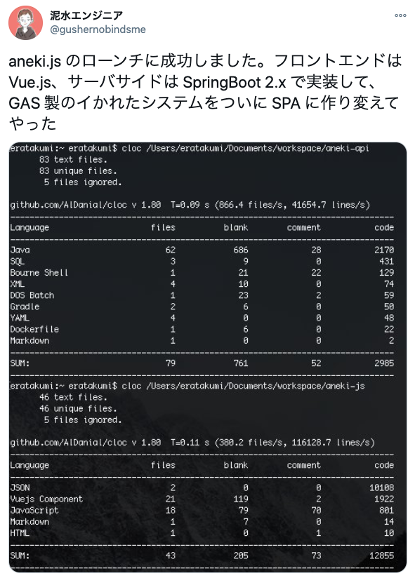

去年に引き続き、今年も振り返りを書いてみる。

# 副業にチャレンジできた
厳密には副業とはちょっと違うけど、今年は「自分が趣味で書いたコードがお金になる」という稀有な体験をさせてもらった。流れとしてはこんな感じ。

- 姉の事務作業を自動化するべくちょっとした GAS を書いた
- データ量が増えて辛くなってきたので Web アプリケーションに作り変えた
- 姉貴の所属企業の IT 部門の目に止まり、ひょんなことから売却できる運びになった

「話をしたい」と言われて恵比寿のドトールに呼び出され、御社の CTO（！）に自分が作った Web アプリケーションのプレゼンをする、というドッキドキのイベントがあったのだけれど、思いのほか好意的に受け止めてもらえ、お褒めの言葉までもらえたのは非常に嬉しかった。御社のドメインを勝手に取得したことについては怒られました。

技術スタック等についてはざっくりこんな感じ。

ちなみに aneki.js は僕の実装した Web アプリケーションの俗称です。

# 「代表作」と言えるようなものが開発できた
こちらは本業の方の話で、去年の 4 月くらいから開発していた機能群が今年の 7 月頃にリリースできた。お客さんへの提案活動みたいなのに同行させてもらったり、チーム横断で PM 業っぽいことをしてプロジェクトを推進したりと、初挑戦だらけのメモリアルなプロジェクトでした。

提案業については、「自分の知ってる周りの優秀なエンジニアたちはみんな経験してるけど、俺にはその経験がないんだよな……」っていうコンプレックスみたいなものがずっとあって。なんとなく今のままじゃダメなような気がして、怯えながらも手を挙げてやらせてもらったんだけど、

- 「課題はそもそもなんなのか」から話を進めるクセが身についた
- 人前で何かを説明するのに物怖じしなくなった
- 資料を作るスピードがなんかようわからんが早くなった

みたいな感じで、色々とベーススキルが上がった気がする。「ウチ以上にウチの会社のことを考えてくれていてありがたい」と言ってもらえたのもじんわりと嬉しかった。まあ、そこに到るまでに色んな人とたくさん揉めたんですが……。

ともあれ、色々あってリリースした機能が、きちんと売上に貢献できていて、正しくドヤれるものになったのは非常に嬉しかったです。

# 学んだこととか
## 技術系
- [『Vue.js入門』を読んだ](/1549152000)
- [『プログラマのための Docker 教科書』を読んだ](/1555286400)
- [『Pragmatic Terraform on AWS』を読んだ](/1569110400)

ブログに書いたもの以外だと、AWS の CodeBuild、Deploy、Pipeline、ECS、ECR、Parameter Store、SSM、ライブラリ の Jib などを触りました。

## 業務知識系
- [『決済システムのすべて』を読んだ](/1566691200)
- [『内部統制の仕組みと実務がわかる本』を読んだ](/1569628800)

ブログに書いたもの以外だと、『怒りに負ける人 怒りを生かす人』と『ヤフーの 1on1』を読んだりしました。

- [怒りに負ける人、怒りを生かす人 | 安藤俊介 |本 | 通販 | Amazon](https://www.amazon.co.jp/dp/4022513675/)
- [ヤフーの1on1―――部下を成長させるコミュニケーションの技法 | 本間 浩輔 |本 | 通販 | Amazon](https://www.amazon.co.jp/dp/4478069786/)

今年は読書量が少なくていまいちなので、来年はもう少し頑張りたい。

# その他
あとは、子供部屋おじさんを卒業したり、作りおきをしたり、トレラン大会に初出場したり、ボルダリングをちゃんとやり始めたり、日本語ラップをちゃんと聞き始めたり色々ありました。

特に日本語ラップはすごくて、聞き始める前と後では心の持ちようがまるで違ってきていて、大変ポジティブに日々を過ごしております。俺は今まで何をやってきたんだ。
ギアを入れたい時によく聞いている曲のリンクを 3 つほど載せておきます。

<iframe width="560" height="315" src="https://www.youtube.com/embed/OmjJWUM8VcA" frameborder="0" allow="accelerometer; autoplay; encrypted-media; gyroscope; picture-in-picture" allowfullscreen></iframe>

<iframe width="560" height="315" src="https://www.youtube.com/embed/vvwpKlXfEp0" frameborder="0" allow="accelerometer; autoplay; encrypted-media; gyroscope; picture-in-picture" allowfullscreen></iframe>

<iframe width="560" height="315" src="https://www.youtube.com/embed/L5JYeP4hbEo" frameborder="0" allow="accelerometer; autoplay; encrypted-media; gyroscope; picture-in-picture" allowfullscreen></iframe>

# おわりに
来年からはやる仕事の性質が若干変わりそうなので、変化に対応するための努力をしつつ、ボルダリング行ったり、山に行ったり、日本語ラップの音源を集めたり、作りおきをしたりして健やかに過ごそうと思います。オススメの音源をお持ちの方は教えてください。おわり。