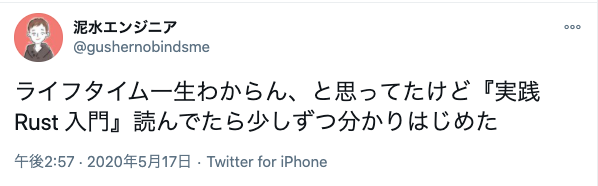

人生にはいろいろあるもんでして、仕事で Rust を使うことになりそうだったので読んでみました。久々に新しい言語の勉強がっつりやった。

- [実践Rust入門[言語仕様から開発手法まで] | κeen, 河野 達也, 小松 礼人 |本 | 通販 | Amazon](https://www.amazon.co.jp/dp/4297105594/)

読んでみた感想としては、

- 他のプログラミング言語と比較しつつ「なぜ Rust なのか？」がしっかり解説してあったり
- 初学者がつまづきやすいポイントについて丁寧な説明があったり
- Web アプリケーションを開発する上で有名なフレームワークについても触れてあったり

という感じで、全体的に満足度の高い一冊でした。

はじめは『The Book』で勉強していたのだけれど、「所有権」とか「ライフタイム」のあたりでちょうどつまづいてしまい、どうしたもんかなあ……という感じだったのですが、この本に詳しく書いてあったのでかなり助かりました。

- [The Rust Programming Language - The Rust Programming Language](https://doc.rust-lang.org/book/)

当時の絶望を物語るツイート：

読書メモはこんな感じ。

- [実践Rust入門_読書メモ](https://gist.github.com/gushernobindsme/4cec7a02bdaa6f8dd7fe4f13a1974b30)

はじめのうちはコンパイルエラーが起き続けるので辛い、という話もよく聞きますが、コンパイラに口うるさく注意してもらえるくらいの方が個人的には助かるので（実行時エラーと戦いたくない）、Rust はかなり好きになれそう。

Rust の勉強を始めてみたけどいまいち捗らない、という人は読んでみるといいんじゃないでしょうか。  