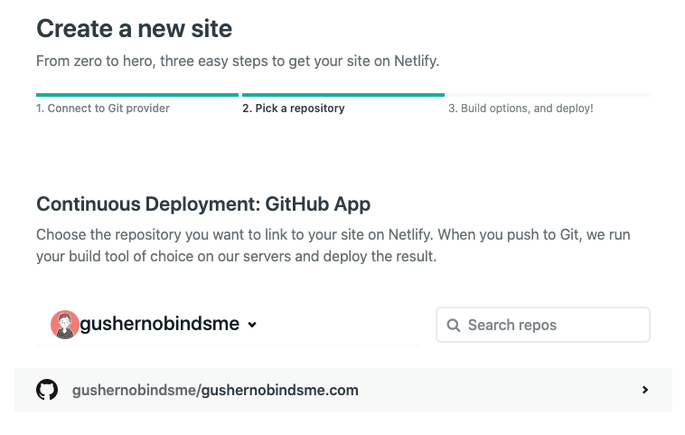
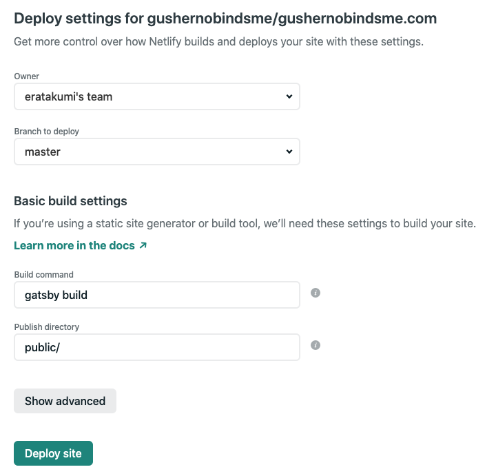

知人がブログを Gatsby に移行していて、なんだか楽しそうなのでやってみました。  

# 構成
構成はざっくりこんな感じ。  

- ブログシステムは [Gatsby](https://www.gatsbyjs.com/) で構築。原稿は Markdown で管理
- サイトは [Netlify](https://www.netlify.com/) でホスティング
- master に変更をプッシュすると Netlify を通じて本番デプロイ

最終的に完成したリポジトリはこちらです。

- https://github.com/gushernobindsme/gushernobindsme.com

# やったこと
以下のコマンドで Gatsby-CLI をインストールし、  

```bash
npm install -g gatsby-cli
```

starter からプロジェクトの雛形を生成して、  

```bash
gatsby new gushernobindsme.com https://github.com/agneym/gatsby-blog-starter
```

あとは `gatsby-config.js` を書き換えたり、デザインを微調整したり、はてなダイアリーから原稿を移行したりして完成。  

構築には、[gatsby-blog-starter](https://www.gatsbyjs.com/starters/agneym/gatsby-blog-starter) というテンプレートを使ったんですが、  

- Markdown を所定のパスに置いて `gatsby develop` するだけでブログ記事が生成される
- Styled Component が使える
- デザインがシンプルで好み

という感じだったので、ほぼカスタマイズなしで使えました。  

あとは、Netlify アカウントを作成して「New site from Git」を選択し、GitHub アカウントと連携。  

リポジトリを選んで、  



「master にプッシュされたら `gatsby build` を実行せよ」と設定して作業完了。  



Gatsby と Netlify のおかげで労せず移行が終わりました。  

# 結果
- はてなブログ時代と比べてブログが爆速になった
- 「Netlify は想像以上に楽」ということがわかった
- 好きにいじれるフロントエンドの実験農場が手に入った

という感じで、やってみてよかったです。

# 参考
構築に際しては以下の Qiita が参考になりました。ありがとうございました。  

- [GatsbyとNetlifyで簡単にブログを作成 - Qiita](https://qiita.com/k-penguin-sato/items/7554e5e7e90aa10ae225)