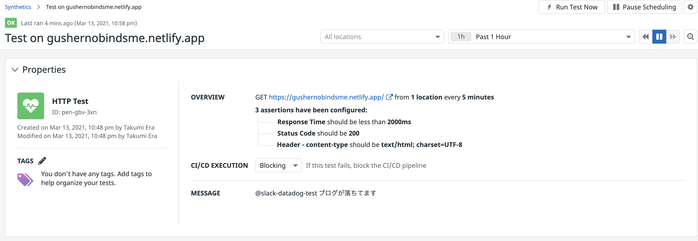

# モチベーション
- 社内に Datadog が導入されて久しいがイマイチちゃんと理解できていない
- （実際に自分で何か設定する機会はないとしても）全体観は抑えておきたい
- 構成要素をざっくり把握できたら、公式ドキュメントもきっと読みこなせるはず

Datadog の本なんてきっと出てないよなあ、と思いつつダメ元でググってみたところ、この本が見つかりました。ありがとう技術書典。  

- [【電子版】Datadogで始めるモニタリング基盤 - yoshihir - BOOTH](https://booth.pm/ja/items/1570482)

# 本書の内容
書いてある内容を三行でまとめるとこんな感じ。  

- Datadog の機能のうち、Synthetics、Monitors、APM、Logs について紹介
- AWS の Fargate 上で動くアプリケーションをお題に監視をハンズオンで設定していく
- クローラー、Agent、Trace を使った監視方法がざっくりわかる

サービスの大まかな雰囲気を掴むのに良い本でした。  
特に、Datadog の機能は「クローラーを使った監視」「Agent を使った監視」「Trace を使った監視」の 3 つに大別される、という点が把握できたのは大きかったです。これで、一定のアタリをつけながら公式ドキュメントに挑めるはず。  

読書メモはこんな感じ。  

- [Datadog で始めるモニタリング基盤_読書メモ](https://gist.github.com/gushernobindsme/0da5a3deb492d02136c0e7e58d041bc2)

本に書いてあることを参考にしつつ、お遊びでこのブログに外形監視を設定してみたのだけど、驚くほど簡単に設定できてよかったです（Netlify が落ちることはそうそうないと思うけど…）。  

アプリケーション監視とログ監視については、AWS 上に設定したいというモチベーションが自分にそれほどないため（やるなら GCP に対して設定したい）、さらっと読んで終わらせちゃいました。  

# まとめ
2h くらいでサクッと読めるボリュームなので、とりあえず一歩を踏み出したい人は読んでみるといいんじゃないでしょうか。  
